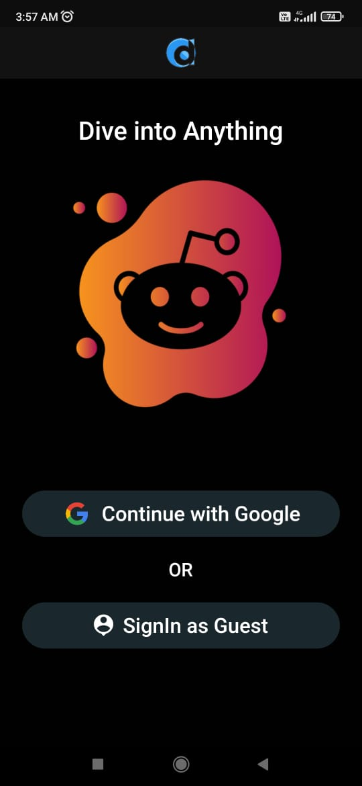
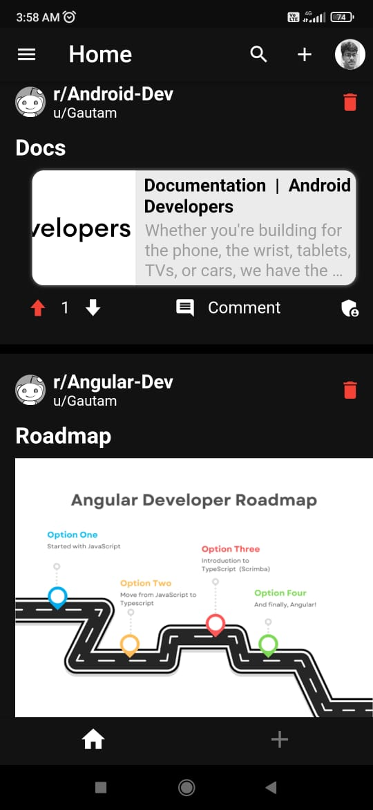
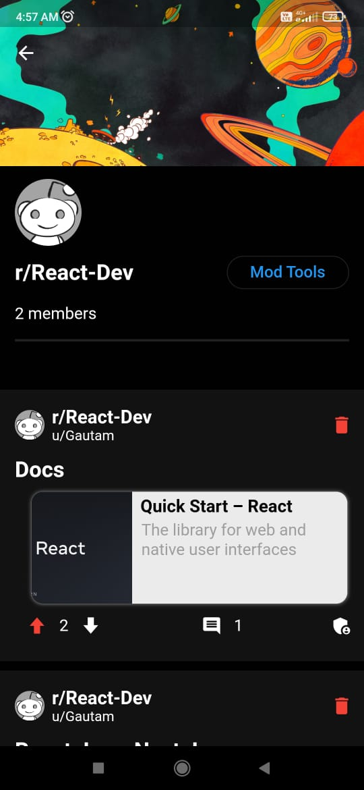
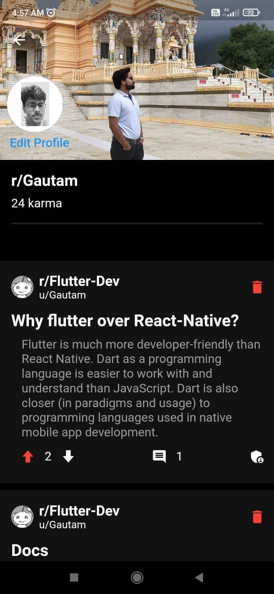

# Dev Socy

Dev Socy is a Flutter app that brings together a diverse community of developers from around the world - all passionate about sharing their thoughts and insights on technology in all its forms. Through Dev Socy, members can share their knowledge, post images and text, and exchange ideas through links, creating a dynamic and engaging platform for collaboration and innovation. Whether you're a novice developer looking to learn or a seasoned expert looking to connect, Dev Socy is the ultimate community for all things tech. Join us today and see where your passion for technology can take you!

## logo


## App Images

|  |  |
|--|--|
|  |  |


## Features

- Google/Guest Authentication
- Create, Join community
- Community Profile (Avatar, Banner, Members)
- Post (link only, photo, text only)
- Displaying Latest Posts
- Upvote, Downvote, Comment
- Update Karma
- Add Moderators
- User Profile (Avatar, Banner)
- Theme Toggle
## Tech Stacks

| Tools                 |                                     Link                                      |
|:----------------------|:-----------------------------------------------------------------------------:|
| 🤖  Language          |                       [Dart](https://dart.dev/)                               |
|  🩶   Framework         |                     [Flutter](https://flutter.dev/)                         |
| 🌐  Authentication    |                 [Google-Auth](https://firebase.google.com/docs/auth )        |
| 💻  Database          |           [Cloud-Firestore](https://firebase.google.com/docs/firestore)     |
| 📁  Storage          |           [Firebase-Storage](https://firebase.google.com/docs/storage)     |
| 🚀  State Management  |              [Riverpod](https://pub.dev/packages/flutter_riverpod)            |
| 🚒  Route Management  |              [RouteMaster](https://pub.dev/packages/routemaster)            |


## Installation

After cloning this repository, migrate to main branch.

- Create Firebase Project
- Enable Authentication (Google Sign In, Guest Sign In)
- Make Firestore Rules
- Create Android, iOS & Web Apps
- Use FlutterFire CLI to add the Firebase Project to this app. Then run the following commands to run your app:
 
```bash
  flutter pub get
  flutter run
```
    
## License


## Contributing

Contributions are always welcome!


